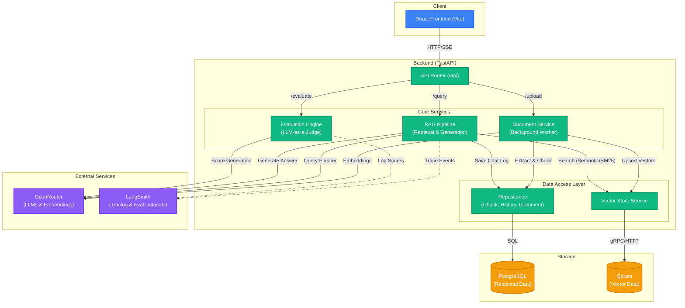

# AI Decision Assistant

A production-grade AI system designed to help users make data-driven decisions by interacting with uploaded documents through contextual, multi-turn reasoning.

## Architecture

This project implements a Clean Architecture paradigm separating the presentation layer, business logic, data access, and third-party integrations.



### System Flow
1. **Frontend**: React (Vite) interface built for premium UX. It handles streaming (SSE) and displays multi-turn reasoning transparently.
2. **Backend**: FastAPI manages routing and validates requests.
3. **Document Service**: Offloads file parsing and chunking into a background worker queue to keep the API highly responsive.
4. **RAG Pipeline**: A sophisticated AI orchestrator that leverages a Query Planner to dynamically route user questions to Semantic, BM25, or Hybrid search layers depending on context.
5. **Storage**: PostgreSQL handles relational metadata (document status, chunk text, chat history), while Qdrant strictly handles dense vector storage.

## Tradeoffs & Design Decisions

### 1. Asynchronous Ingestion (Background Tasks vs Sync)
**Decision**: Document ingestion and embedding are pushed to a background task worker.
**Tradeoff**: While this requires a slightly more complex UI (polling for document status), it prevents the API from blocking during large PDF uploads, guaranteeing a highly responsive chat application at scale.

### 2. Multi-Turn RAG (LLM Query Rewriting vs Naive Vector Search)
**Decision**: We use an LLM "Retrieval Planner" to rewrite queries and resolve pronouns before searching the vector database.
**Tradeoff**: This adds an extra LLM call (increasing latency slightly), but radically improves *AI Correctness* by ensuring follow-up questions like "What did you mean by that?" are rewritten into dense semantic concepts before searching.

### 3. Dual Database (PostgreSQL + Qdrant)
**Decision**: Chunk texts and conversation logs are stored in PostgreSQL, while embeddings are stored in Qdrant.
**Tradeoff**: Managing two databases adds infrastructure complexity, but it ensures that Qdrant is strictly optimized for fast ANN (Approximate Nearest Neighbor) vector searches, while PostgreSQL securely handles relational integrity and BM25 full-text search fallbacks.

## Reliability & Fault Tolerance

- **Circuit Breakers**: If PDF parsing fails, the background worker safely traps the exception and flips the document state to `"failed"`, instantly informing the UI without crashing the backend.
- **Retry Logic & Backoff**: Langchain integrations are wrapped with exponential backoff (`max_retries=3`) and strict timeouts (30s-60s) to gracefully handle OpenAI API rate limits and network degradation.
- **Graceful Degradation**: If the Retrieval Planner hallucinations an invalid JSON plan, the system safely catches the exception and falls back to a broad "hybrid" search.

## Observability & Evaluation

- **LangSmith Tracing**: Every LLM interaction, token count, and retrieval latency is logged to LangSmith for real-time observability.
- **UI Telemetry**: The React frontend visually exposes the Retrieval Planner's internal decision-making (Mode, Rewritten Query, Chunk Count, Latency) so the user isn't kept in the dark.
- **LLM-as-a-Judge Evaluation Engine**: Includes a dedicated `evaluate_prompts.py` script and a `/api/evaluate` UI endpoint that quantitatively grades RAG responses on **Faithfulness**, **Relevance**, and **Groundedness**.

## Quickstart

### Prerequisites
- Docker & Docker Compose
- Python 3.11+

### Setup
Create a `.env` in the root directory:
```env
OPENROUTER_API_KEY=your_key_here
LANGCHAIN_TRACING_V2=true
LANGCHAIN_API_KEY=your_key_here
LANGCHAIN_PROJECT=ai_decision_backend
```

### Run the Application
Use the unified start script:
```bash
./start.sh
```
This automatically spins up Qdrant and PostgreSQL via Docker, creates a Python virtual environment, installs dependencies, and launches the FastAPI server. 

To run the Frontend (in a separate terminal):
```bash
cd frontend
./start.sh
```
